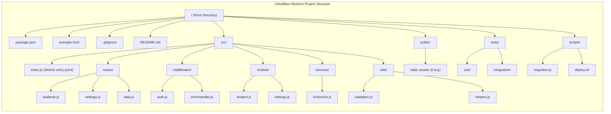
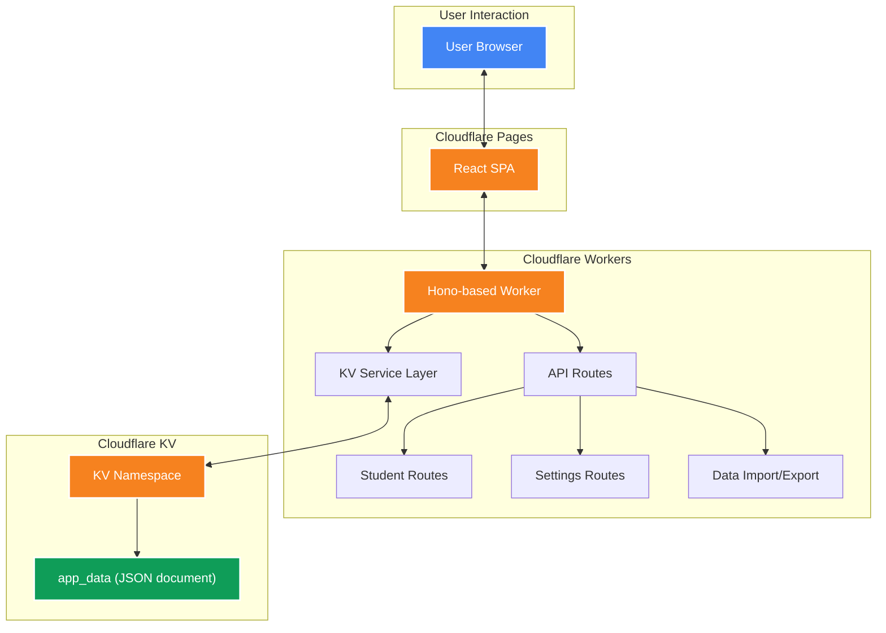

# Kids Reading Manager - Cloudflare Migration Architecture

## Overview

This document outlines the architectural approach for migrating the Kids Reading Manager application from its current Node.js/Express backend with JSON file storage to a Cloudflare Workers architecture with KV storage.

## Current vs. New Architecture Comparison

| Aspect | Current Architecture | Cloudflare-based Architecture |
|--------|---------------------|------------------------------|
| **Frontend** | React SPA | React SPA (deployed to Cloudflare Pages) |
| **Backend** | Node.js/Express | Cloudflare Workers with Hono framework |
| **Data Storage** | Single JSON file (`/config/app_data.json`) | Cloudflare KV (single JSON document) |
| **Deployment** | Single Docker container | Serverless (Cloudflare Workers + Pages) |
| **Scaling** | Manual scaling via container instances | Automatic scaling via Cloudflare's global network |
| **Performance** | Limited by server location | Global edge network with low latency |
| **Maintenance** | Container updates, server management | Zero server maintenance |
| **Cost Model** | Fixed cost for server resources | Pay-per-request model |
| **Development** | Traditional server development | Serverless function development |
| **Data Backup** | Manual file backups | Automatic KV replication across Cloudflare network |

## Project Structure Diagram



## Architecture Diagram



## Data Flow

1. **Read Operations**:
   - React frontend makes API requests to Cloudflare Worker endpoints
   - Worker retrieves the entire app_data JSON document from KV storage
   - Worker extracts and returns the relevant portion of data (students, settings, etc.)

2. **Write Operations**:
   - React frontend sends update requests to Cloudflare Worker endpoints
   - Worker retrieves the current app_data JSON document from KV
   - Worker updates the relevant portion of the data
   - Worker writes the entire updated JSON document back to KV

3. **Data Consistency**:
   - All data operations are atomic at the document level
   - KV storage provides eventual consistency across Cloudflare's global network

## KV Storage Strategy

The application will use a single KV namespace with a primary key `app_data` that stores the entire application state as a JSON document:

```json
{
  "students": [
    {
      "id": "uuid-1",
      "name": "Student Name",
      "lastReadDate": "2025-04-01",
      "readingSessions": [
        {
          "id": "session-uuid-1",
          "date": "2025-04-01",
          "assessment": "Level 3",
          "notes": "Good progress"
        }
      ]
    }
  ],
  "settings": {
    "readingStatusSettings": {
      "recentlyReadDays": 14,
      "needsAttentionDays": 21
    }
  },
  "metadata": {
    "lastUpdated": "2025-04-09T17:00:00Z",
    "version": "1.0"
  }
}
```

## Migration Strategy

1. **Data Migration**:
   - Export current data from the existing system using the `/api/data` endpoint
   - Use a migration script to format and upload the data to Cloudflare KV
   - Verify data integrity after migration

2. **Deployment Sequence**:
   - Deploy Cloudflare Worker with KV binding
   - Deploy React frontend to Cloudflare Pages
   - Configure Pages to use the Worker for API requests
   - Test end-to-end functionality
   - Switch DNS to point to the new Cloudflare deployment

## Performance Considerations

1. **KV Read/Write Limits**:
   - KV values are limited to 25MB (sufficient for the application's data model)
   - Consider implementing caching strategies for frequently accessed data

2. **Worker Execution Limits**:
   - Workers have a CPU time limit (10-50ms depending on plan)
   - Optimize data processing to minimize CPU usage

3. **Request Rate Limits**:
   - Monitor request rates to ensure they stay within Cloudflare's limits
   - Implement rate limiting on the client side if necessary

## Security Considerations

1. **Authentication**:
   - Implement JWT-based authentication for API access
   - Use Cloudflare Access for admin functions if needed

2. **Data Protection**:
   - Ensure sensitive student data is properly encrypted
   - Implement proper access controls for the KV namespace

## Monitoring and Maintenance

1. **Logging**:
   - Use Cloudflare Workers logging for debugging and monitoring
   - Implement structured logging for easier analysis

2. **Metrics**:
   - Monitor KV usage and request patterns
   - Set up alerts for abnormal patterns or errors

3. **Backup Strategy**:
   - Implement periodic backups of the KV data to external storage
   - Create a disaster recovery plan